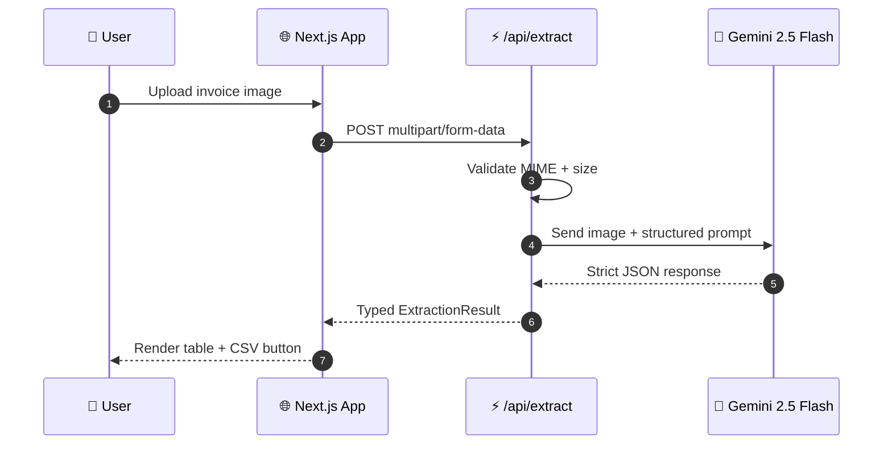

<!-- ═══════════════════════════════════════════════════════════════════════ -->
<!--                          ANIMATED HEADER BANNER                          -->
<!-- ═══════════════════════════════════════════════════════════════════════ -->

<div align="center">


<a href="https://invoice-extractor-coral-nu.vercel.app">
  
</a>

<br/>

<a href="https://invoice-extractor-coral-nu.vercel.app">
  
</a>
<a href="https://github.com/Abdulgeni/invoice-extractor/issues">
  
</a>
<a href="https://github.com/Abdulgeni/invoice-extractor/stargazers">
  
</a>

<br/><br/>


</div>

<br/>

<!-- ═══════════════════════════════════════════════════════════════════════ -->

<div align="center">

## 🧠 What is Synthetix?

**Synthetix** is an enterprise-grade document intelligence platform that turns **any invoice or receipt image** into **clean, structured, exportable data** — in seconds.

Upload a PNG, JPG, or JPEG. Gemini 2.5 Flash Vision analyzes the image, identifies the layout, and returns a strictly-typed JSON payload containing the **vendor**, **invoice number**, **date**, **total amount**, and **every line item** with quantities and prices. One click exports it all to CSV for your accounting pipeline.

<br/>

> *"It doesn't match keywords. It doesn't use templates. It reads the invoice the way a human accountant would."*

</div>

<br/>

<!-- ═══════════════════════════════════════════════════════════════════════ -->

## ✨ Feature Highlights

<table>
<tr>
<td width="50%" valign="top">

### 🎯 Extraction Engine
- **Real AI vision** — Gemini 2.5 Flash, not regex
- **Vendor** identification
- **Invoice number** parsing
- **Date** normalization (ISO 8601)
- **Total amount** with currency
- **Line items** — description, qty, unit price, subtotal

</td>
<td width="50%" valign="top">

### 🖥️ User Experience
- **Drag-and-drop** upload UI
- **PNG / JPG / JPEG** support
- **Live processing** indicator
- **Clean, professional** dark UI
- **CSV export** for accounting tools
- **Zero-config** deploy to Vercel

</td>
</tr>
</table>

<br/>

<!-- ═══════════════════════════════════════════════════════════════════════ -->

## 🎬 How It Works



<br/>

<!-- ═══════════════════════════════════════════════════════════════════════ -->

## 🚀 Quick Start

### 1. Clone

```bash
git clone https://github.com/Abdulgeni/invoice-extractor.git
cd invoice-extractor
```

### 2. Install

```bash
npm install
```

### 3. Configure Environment

Create a `.env.local` file in the project root:

```env
GEMINI_API_KEY=your_gemini_api_key_here
```

> 🔑 Get a **free** API key at **[aistudio.google.com/apikey](https://aistudio.google.com/apikey)**

### 4. Run

```bash
npm run dev
```

Open **[http://localhost:3000](http://localhost:3000)** and drop in your first invoice. 🎉

<br/>

<!-- ═══════════════════════════════════════════════════════════════════════ -->

## 📁 Project Architecture

```
invoice-extractor/
├── app/
│   ├── api/
│   │   ├── extract/route.ts     ⚡ Upload → Gemini → structured JSON
│   │   └── export/route.ts      📥 JSON → CSV stream
│   ├── icon.svg                 🎨 Custom brand favicon
│   ├── layout.tsx               🧩 Root layout + metadata
│   ├── globals.css              🎨 Tailwind base
│   └── page.tsx                 🏠 Landing page
├── components/
│   └── InvoiceUploader.tsx      🖼️ Upload UI + results table
├── lib/
│   └── gemini.ts                🤖 Gemini Vision client
├── public/
├── package.json
└── README.md
```

<br/>

<!-- ═══════════════════════════════════════════════════════════════════════ -->

## 🛠️ Tech Stack

<div align="center">

| Layer | Technology | Purpose |
|:---:|:---:|:---|
| **Framework** |  | App Router, Server Actions, API routes |
| **Language** |  | End-to-end type safety |
| **Styling** |  | Utility-first design system |
| **AI** |  | Multimodal vision extraction |
| **SDK** |  | Official Gemini client |
| **Hosting** |  | Edge deployment + CI/CD |

</div>

<br/>

<!-- ═══════════════════════════════════════════════════════════════════════ -->

## 📊 Example Output

**Input:** A scanned invoice from *East Repair Inc.*

**Output:**

```json
{
  "vendor": "East Repair Inc.",
  "invoiceNumber": "US-001",
  "date": "2019-11-02",
  "totalAmount": "$154.06",
  "lineItems": [
    {
      "description": "Front and rear brake cables",
      "quantity": 1,
      "unitPrice": "$100.00",
      "subtotal": "$100.00"
    },
    {
      "description": "New set of brake pads",
      "quantity": 2,
      "unitPrice": "$24.00",
      "subtotal": "$48.00"
    }
  ]
}
```

<br/>

<!-- ═══════════════════════════════════════════════════════════════════════ -->

## 🔌 API Reference

### `POST /api/extract`

Extracts structured data from an uploaded invoice image.

**Request** — `multipart/form-data`

| Field | Type | Required | Description |
|:---|:---:|:---:|:---|
| `file` | `File` | ✅ | Invoice image (PNG, JPG, or JPEG) |

**Response** — `200 OK`

```json
{
  "vendor": "string",
  "invoiceNumber": "string",
  "date": "string (ISO 8601)",
  "totalAmount": "string",
  "lineItems": [
    {
      "description": "string",
      "quantity": 0,
      "unitPrice": "string",
      "subtotal": "string"
    }
  ]
}
```

**Errors**

| Status | Meaning |
|:---:|:---|
| `400` | Missing file or unsupported MIME type |
| `500` | Gemini API failure or malformed response |

---

### `POST /api/export`

Converts an extraction result into a downloadable CSV.

**Request** — `application/json` (the object returned by `/api/extract`)

**Response** — `text/csv` with `Content-Disposition: attachment`

<br/>

<!-- ═══════════════════════════════════════════════════════════════════════ -->

## 🌐 Deployment

### Deploy to Vercel in 60 seconds

[](https://vercel.com/new/clone?repository-url=https://github.com/Abdulgeni/invoice-extractor)

1. Click the button above
2. Add the environment variable `GEMINI_API_KEY`
3. Hit **Deploy**

That's it. Vercel handles the build, CDN, and HTTPS automatically.

<br/>

<!-- ═══════════════════════════════════════════════════════════════════════ -->

## 🗺️ Roadmap

- [x] Upload PNG / JPG / JPEG invoices
- [x] AI-powered field extraction
- [x] Line-item parsing
- [x] CSV export
- [ ] 📄 Multi-page PDF support
- [ ] 📦 Batch upload (multiple invoices at once)
- [ ] 🗄️ Extraction history + saved results
- [ ] 🔗 QuickBooks / Xero integration
- [ ] 🌍 Multi-language invoice support
- [ ] 🔐 User accounts & team workspaces

<br/>

<!-- ═══════════════════════════════════════════════════════════════════════ -->

## 🤝 Contributing

Contributions are what make open source amazing. Any contribution you make is **genuinely appreciated**.

1. **Fork** the repository
2. **Create** your feature branch
   ```bash
   git checkout -b feature/amazing-feature
   ```
3. **Commit** your changes
   ```bash
   git commit -m "feat: add amazing feature"
   ```
4. **Push** to the branch
   ```bash
   git push origin feature/amazing-feature
   ```
5. **Open** a Pull Request

> 💡 Please follow [Conventional Commits](https://www.conventionalcommits.org/) for commit messages.

<br/>

<!-- ═══════════════════════════════════════════════════════════════════════ -->

## 📜 License

Distributed under the **MIT License**. See [`LICENSE`](LICENSE) for more information.

<br/>

<!-- ═══════════════════════════════════════════════════════════════════════ -->

## 👤 Author

<div align="center">

**Abdulgeni**

<a href="https://github.com/Abdulgeni">
  
</a>

*Built with Next.js, TypeScript, and Google Gemini AI.*

</div>

<br/>

<!-- ═══════════════════════════════════════════════════════════════════════ -->

<div align="center">

### ⭐ If Synthetix saved you time, consider giving it a star!

<a href="https://github.com/Abdulgeni/invoice-extractor/stargazers">
  
</a>

<br/><br/>


</div>